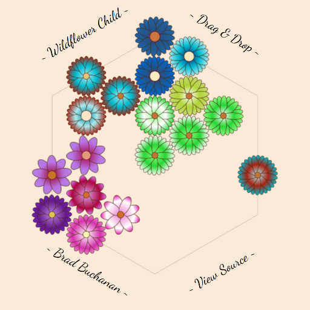

# Wildflower Child 

**Wildflower Child** is a flower-generator toy.  Players can drag and drop
flowers to different positions on the board.  If a flower is dropped next to
another flower and there's an empty space nearby, a child flower is created
by mixing the genome of the parent flowers.  There's no objective - just
fill up the board with pretty flowers and share what you've created!

This game was originally created for GitHub Game Off 2017.  I only had a few
free days to work on the jam and the "Throwback" theme drove me to the antique
illustration look that sort of developed here.  I do think there are parts
for a more robust puzzle game here - I might explore that in the future.

## See Also

- https://islemaster.itch.io/wildflower-child
